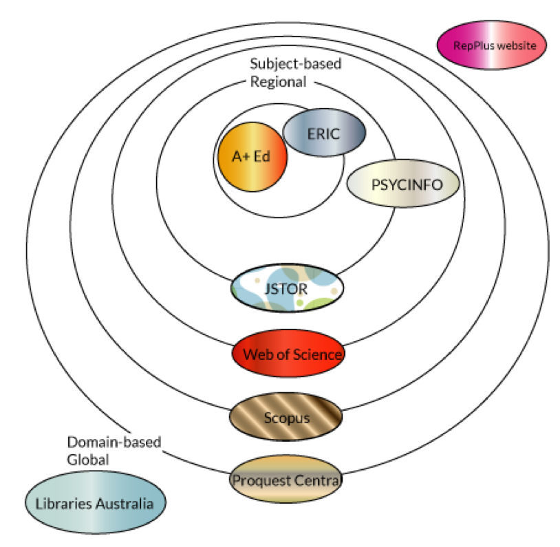

# Methodology
## Systematic scoping review

I chose the systematic scoping review as a methodological approach with the aim of providing a “baseline” for research on Repertory Grid Technique (RGT) at this point in time. A true systematic review requires multiple researchers, often working across institutions, thus unsuitable for a single PhD candidate. Even scoping reviews are sometimes done by multiple researchers, particularly if the topic has a large literature base.

Before deciding on this methodology I did some preliminary searches to check that it was viable, and discussed the approach at length and in-person with our Faculty Librarian (to whom I am very grateful).

The first part of my approach is to use a combination of the EndNote bibliographic database and the MAXQDA2020 Qualitative Data Analysis System {VERBI Software, 2017 #65} to collect and categorise the broad sweep of documents gathered through the process. A separate document describes the specific procedural steps taken within the software applications and describe how a systematic scoping review is conducted. The initial papers telling me how to do the scoping review were given to me by the Librarian and I use them here to explain how this review type is appropriate to the thesis apart from the single/multiple researcher issue. While the Joanna Briggs Institute recommends two researchers for scoping reviews {Peters, 2015 #5}, the affordances of a QDA application makes it viable for a single reviewer in a search of limited scope.  

There are many types of structured literature reviews, and while the methodology for full systematic literature reviews is well established in many fields, less rigorous methods are not as well-defined {Arksey, 2005 #7}. The ‘scoping’ approach is purposeful in this study, as I aim to review the broad range of research on using RGT in education, summarising and disseminating reports of pedagogical and research implementation, and identifying gaps in the research which could be usefully addressed. However, where scoping reviews may not traditionally measure the success of the studies it finds {Arksey, 2005 #7}, in this research I will foreground case studies which have demonstrated results and use them as models for additional methodology development.

Following the framework suggested by Arksey and O’Malley (2005), I use a staged approach to develop a research question and protocol for finding relevant studies, summarising findings, then reporting the results. I will adapt the Arksey idea of consultation in the review process in two parts. Where specific centres of practice for RGT can be identified, insights will be sought from that area around the scope and inclusiveness of the review, and whether there is anecdoctal or evidential reports of which  pedagogical models and resources are most helpful. As an important feature of systematic scoping reviews is replicability {Arksey, 2005 #7;Peters, 2015 #5}, the process I used is set out in rigorous transparency in this chapter.

## Identifying the research question
While the broad research question has been established as “How is Repertory Grid Technique used in higher education?”, Arksey and O’Malley (2005) suggest beginning by considering which aspects of the question are most important to develop a search strategy. “Repertory Grid Technique” is unambiguous conceptually and the most important feature.

However, it might be described using different phraseology, for example, RepGrid, and that must be clear in the search parameters. “Education” is potentially more difficult, as it is a very broad field ranging from 0-5 childhood right through to professional education. The target audience for this study is higher education students, instructors and researchers, which might not be specified in accessible search fields, requiring closer reading to establish. This is consistent with Arksey and O’Malley (2005) description of the process of scoping reviews as iterative and reflexive while at the same time comprehensive and documented in detail. While {Booth, 2019 #2} talks to the difficulty of iteration in a systematic way, they suggest that it is still possible to engage in a transparent manner.

{Booth, 2019 #2} realist view is based on six principles which align in many ways with those of Arksey & O'Malley (2005).    

## Finding relevant studies
While I had found a range of studies around RGT in education in previous research enterprises, for this systematic scoping review I set those aside as [can’t remember the metaphor for something that should be found through those other searches]. Faculty Librarian suggested a series of expanding database searches focused initially in Australia and about Education, then extending out as far as initial parameters allow.

Figure 1: Database search sequence & strategy

I blended this with additional possible sources listed in the University of Sydney Library’s [Systematic Review Toolkit](https://library.sydney.edu.au/research/systematic-review/?section=before-you-start). In addition to database searching, a key website was also used to find relevant studies. < http://pages.cpsc.ucalgary.ca/~gaines/repplus/> contains years of research by Gaines & Shaw, conceptual and technical experts and developers of the technical and statistical infrastructure on which computerised implementation of the Repertory Grid Technique can be deployed.

Before I finalised my research question, I checked for registration of systematic reviews at Joanna Briggs Institute at 1138 on Saturday 28 Sep. 19 using the search term “repertory”, and no titles were returned. I also checked PROSPERO at 1140 on the same day, identifying three registrations of systematic review in progress. Two were related to specific medical interventions, and the other to psychotherapy {Helena García-Mieres,  #68;Lauren Brown,  #67;Mozart Walz,  #66} so they are outside the scope of this review.

The search parameters I used were intended to be broad enough to find studies that did not always use the full terminology “repertory grid technique”, but defined enough so studies referring to software development tools “WebGrid”, reactive gas technique “RGT”, or reactive gas timing “RGT”. Parameters for each database differ slightly to reflect their conventions and constraints. Searches were performed in the order below.

_Table n: Sequence of searches._

| Search order | Source                                                         |
|--------------|----------------------------------------------------------------|
| 1.           | A+                                                             |
| 2.           | ERIC                                                           |
| 3.           | PSYCINFO                                                       |
| 4.           | JSTOR                                                          |
| 5.           | Web of Science                                                 |
| 6.           | Scopus                                                         |
| 7.           | PROSPERO                                                       |
| 8.           | Proquest                                                       |
| 9.           | Cochrane Library                                               |
| 10.          | TRIP                                                           |
| 11.          | epistemonikos                                                  |
| 12.          | http://pages.cpsc.ucalgary.ca/~gaines/reports/                 |
| 13.          | http://pages.cpsc.ucalgary.ca/~gaines/repplus/markdown/        |
| 14.          | http://pages.cpsc.ucalgary.ca/~gaines/BooseBradshaw/index.html |

__PSYCINFO returned a high number of results, which is expected because of RGT’s origin in Personal Construct Psychology. Two approaches were taken to reduce this set to more relevant studies. First, repeating the search without the ALL “repertory grid technique”, to exclude studies where it is used as background or in the bibliography. While the second search still returned over 900 results, a manual review was done to identify those in educational contexts, OR by authors of previously identified key works [eg Markus Heckmann].__

With JSTOR, in contrast, only 10% of articles have abstracts, so the full text search was important, even though it returned 266 different works (and it’s very painful to export from JSTOR so I’d rather get them all out now). While Web of Science does allow refinement by category, as there are only 165 papers returned from the search of 71,985,608 so I will manually check those as there appears to be only 1 or two in each category so it would take me more time to do all those checkboxes (see JSTOR above :-\).

__Known issue with Scopus 30/9 where "We have identified an issue which means that some sources will face delays in new issues being added to Scopus. We apologize for any inconvenience and will share updates via Twitter (@Scopus) and via the Scopus blog here" (no info about which sources or delay on blog, just watch blog or @scopus for updates).__ Because it returned so many results, used limiters to include only social sciences, psychology, arts, decision science, neuroscience, multidisciplinary and undefined. Full details are at /Users/eb/Dropbox/Documents/-Fed/Termites-and-Butterflies/Documents/0_Chapters-see GitHub-repgrid/300_method/refining-scopus.docx

The subject filter in ProQuest was not suitable for refinement as categories do not reflect my differentiation (eg studies, humans etc.). A high proportion of these results were in theses, so I refined the search to search only the title and abstract, because I wanted only studies in which the technique was foregrounded as they would be the most useful.

As the Cochrane Library search only returned 17 references they were manually checked.

As I didn’t have a PRO TRIP subscription, I manually copied and pasted the web results into Excel for checking prior to setting up a RIS in EN for them.

Epistemonikos is also focused on health and clinical psychology.

The initial search phase results are at Table n.

_Table n: Initial search results before duplicates were removed._

| Database         | Results for search |               |
|------------------|--------------------|---------------|
| A+               | 76                 |               |
| ERIC             | 205                |               |
| PSYCINFO         | 957                |               |
| JSTOR            | 255                |               |
| Web of Science   | 165                |               |
| Scopus           | 1946               |               |
| PROSPERO         | 2                  |               |
| Proquest         | 603                |               |
| Cochrane Library | 17                 |               |
| TRIP             | 33                 | not yet in EN |
| epistemonikos    | 9                  |               |
| total            | 4235               |               |
| EN =             | 4243               |               |
| method           | 7                  |               |
| test             | 1                  |               |
| diff             | 0                  |               |

The subject databases accessed are focused more on Randomised Control Trials, so additional searches across grey literature are also relevant. Substantial bodies of work are available from the authors of the WebGrid RepGrid analysis software (Shaw and Gaines, 2018), as seen at Table N.

_Table n: Results from the RepPlus website._

| Webpage                                                        | Results for search                                                                                                                                                                                                                                               |
|----------------------------------------------------------------|------------------------------------------------------------------------------------------------------------------------------------------------------------------------------------------------------------------------------------------------------------------|
| http://pages.cpsc.ucalgary.ca/~gaines/reports/                 | 196 (197 less 1 duplicate)
 | http://pages.cpsc.ucalgary.ca/~gaines/repplus/markdown/        | 49 (1 duplicate = 48, Carol tutorial not file, just HTML folder = 47)                                                                                                                                                                                           |
| http://pages.cpsc.ucalgary.ca/~gaines/BooseBradshaw/index.html | 28 (no duplicates)                                                                                                                                                                                                                                               |

All results for each search set are set out at /Users/eb/Dropbox/Documents/-Fed/Termites-and-Butterflies/Data/Document-Reviews

All PDF and Microsoft Word document files were downloaded from each web page. Folder contents were saved as text and compared with the links in each web page to identify duplicates or non-document files. One HTML page was saved as PDF and the embedded movie converted to current MP4 standards; two duplicates were removed.

I created a specific EndNote library for each search set of documents, attaching full-text to each bibliographic record. This ensured that as iterative refinement of protocol appropriate to scoping reviews {Peters, 2015 #5} occurred, the previous document sets could be re-examined in this light.

To create a sense of narrative for myself in the process, I began by reviewing the first document related to Repertory Grid Technique in Education, Milded G. Shaw's thesis "On becoming a personal scientist: interactive computer programs for developing personal models of the world" {Shaw, 1978 #194}. The Literature Review chapter sets out how this foundation informed a wide range of activities across teaching and research which are relevant to this study and beyond. (for my own notes, my Summary is at ../../Summaries/Shaw. recognised the tensions inherent in the need for educational contexts to connect personally meaningful concepts with established traditions and.docx).

Following the thesis, I download and reviewed all documents from the RepPlus website <https://pages.cpsc.ucalgary.ca/~gaines/repplus/>. I created a matching bibliographic record for each downloaded file and attached the relevant PDF (about 12 minutes each for 196 documents). While, as said above, the principal statistical and technical infrastructure around the computerised implementation of RGT was developed by Mildred G Shaw, she and her colleague at SERN Brian Gaines wrote so much together and cited each other frequently, it was important to go through all their joint and individual publications rather than just hers.

Where there were discrepancies in publication titles, years or provenance between my record and the citation at http://pages.cpsc.ucalgary.ca/~gaines/reports/, the  information available in the document itself was was used.

After double checking all documents, I recorded the subset each record was in on the RepPlus site (for example, "Education and Learning" or "Modelling Psychological and  Social Systems") , although they are quite loosely construed and should not be considered prescriptive in my opinion. The content of the website itself (Home page, History page) was not a part of this standalone review.

As the body of work from Shaw and Gaines was substantial, I elected to test the MAXQDA import with a smaller document set until my workflow was established. I selected the epistemonikos output as it had a small number of files but more than one. In EN, I checked all abstracts were in place and attached full-text where available. I renamed all attachments to author-date-title format as this is the document title that will display in MAXQDA and consistency is helpful, and with the understanding that the next import will bring a substantial number of documents in with identical authors and years it is necessary to tell one from another easily. After saving these as a new Library and exporting the file data as .RIS, I opened MAXQDA2020 and used the EndNote import function to select the .RIS, then the .ENL, to import both the "References" and References> Attachments. I moved the PDFs (Attachments) into the RIS (References) folder which I retitled epistemonikos.

From a surface perspective, all the article titles are about people in some kind of therapeutic engagement. For me, this is what I categorise as "clinical". I then reviewed each articles further in 2020 to see which terms I should exclude from the next phase of search strategy. At the same time, I had the opportunity to contribute to my broader Literature Review by using this sample data set to also find terms to exclude from data analysis. As the two sets of terms were likely to be substantially similar, I chose a data-driven approach to identifying terms within this set of records which could be useful to limit results in future searches and provide cleaner data for analysis.

I first created individual word clouds and word frequency tables for each document in the epistemonikos project to identify terms were not relevant to this review. To reduce clutter in these reports, it is customary to use a list of "stop" words not relevant to the researchers analytical frame.

MAXQDA2020 offers one set of pre-configured stop list words in English, principally "definite and indefinite articles, conjunctions, or numerals". {VERBI Software, 2019 #7616}. Even though these lists had been uploaded, the clouds and tables showed that several variations were still included. To remedy this, I used the application's interface to manually add words already established as stop words (for example, "a", "the" and "did") to the stop list. This is appropriate to use for my review, but is not adequate to exclude the range of clinical or therapeutic contexts which are not relevant to higher education learning, teaching and research, particularly for databases with large output sets such as PSYCHINFO.

Once I had uploaded the additional stop word list to MAXQDA2020, I re-ran the word frequency analysis to check that the result foregrounded more relevant terms, such as "self", "group", and "cognitive". While these terms may be found in a clinical context, they are also potentially relevant to educational research and could not be excluded at this stage of the review.

My next step was to work through the frequency table line by line, and develop a custom stop list based on my research aim - to provide a benchmark of how RepGrid has been operationalised in education, preferably higher education. By the 100th row of the frequency output, variations on the previous terms were frequent and I concluded it was likely I had reached saturation of these terms, at least for this data set.

After reviewing these 100 terms, I then broke them down into categories, and determined those that may be too relevant to exclude. The data from this is at Table N.

| possessives | articles | conjunctions | generic research words | tech  | other   | numbers  | clinical terms from epistemonikos-all | add to specific stop list just for RepGrid terms | retained       | reason                                                                |
|-------------|----------|--------------|------------------------|-------|---------|----------|---------------------------------------|--------------------------------------------------|----------------|-----------------------------------------------------------------------|
| their       | the      | and          | found                  | https | yes     | one      | patient                               |                                                  | self           | PCP foundation                                                        |
| our         |          | of           | research               | http  | had     | two      | patients                              |                                                  | heart          | may be used in another context, but add to stop if continual clinical |
|             |          | also         | reported               | doi   | using   | three    | medication                            |                                                  | adherence      | difficult to contextualise                                            |
|             |          | for          | measures               | www   | to      | four     | medicine                              |                                                  | belief/s       | PCP foundation                                                        |
|             |          | with         | used                   | com   | related | five     | medicines                             |                                                  | grid           | RepGrid                                                               |
|             |          |              | review                 |       | life    | six      | clinical                              |                                                  | group          | important for my context                                              |
|             |          |              | results                |       | in      | seven    | clinician                             |                                                  | study          | difficult to contextualise                                            |
|             |          |              | people                 |       | non     | eight    | depression                            |                                                  | failure        | difficult to contextualise                                            |
|             |          |              | data                   |       | years   | nine     | surgery                               | constructs                                       |                | PCP foundation                                                        |
|             |          |              | compare                |       | would   | ten      | therapy                               | elements                                         |                | PCP foundation                                                        |
|             |          |              | compares               |       | there   | twenty   | psychosis                             |                                                  | treatment      | may be used in another context, but add to stop if continual clinical |
|             |          |              | compared               |       | weight  | thirty   | psychoses                             | personal                                         |                | PCP foundation                                                        |
|             |          |              | analysis               |       | aqlq    | forty    | disease                               |                                                  | score/s        | difficult to contextualise                                            |
|             |          |              | outcome                |       | did     | fifty    | pgi                                   |                                                  | adherent       | difficult to contextualise                                            |
|             |          |              | based                  |       | use     | sixty    | schizophrenia                         |                                                  | individual/s   | difficult to contextualise                                            |
|             |          |              | studies                |       | used    | seventy  | clin                                  |                                                  | cognitive      | difficult to contextualise                                            |
|             |          |              | study                  |       | seiqol  | eighty   | chronic                               |                                                  | subject/s      | may be used in another context, but add to stop if continual clinical |
|             |          |              | journal                |       | na      | ninety   | med                                   |                                                  | care           | difficult to contextualise                                            |
|             |          |              | sample                 |       | new     | hundred  | nr                                    |                                                  | generated      | difficult to contextualise                                            |
|             |          |              | et                     |       | age     | thousand | recovery                              |                                                  | health         | difficult to contextualise                                            |
|             |          |              | al                     |       | time    | million  | depression                            | technique                                        |                | PCP foundation                                                        |
|             |          |              |                        |       | could   | number   | trial                                 |                                                  | months         | difficult to contextualise                                            |
|             |          |              |                        |       | were    | numbers  |                                       |                                                  | quality        | difficult to contextualise                                            |
|             |          |              |                        |       |         |          |                                       |                                                  | scale          | PCP foundation                                                        |
|             |          |              |                        |       |         |          |                                       |                                                  | control/s      | may be used in another context, but add to stop if continual clinical |
|             |          |              |                        |       |         |          |                                       |                                                  | identity       | difficult to contextualise                                            |
|             |          |              |                        |       |         |          |                                       |                                                  | mean           | difficult to contextualise                                            |
|             |          |              |                        |       |         |          |                                       |                                                  | activities     | difficult to contextualise                                            |
|             |          |              |                        |       |         |          |                                       |                                                  | fluid          | difficult to contextualise                                            |
|             |          |              |                        |       |         |          |                                       |                                                  | social         | difficult to contextualise                                            |
|             |          |              |                        |       |         |          |                                       |                                                  | management     | difficult to contextualise                                            |
|             |          |              |                        |       |         |          |                                       | rgt                                              |                | PCP foundation                                                        |
|             |          |              |                        |       |         |          |                                       |                                                  | mars           | may be used in another context, but add to stop if continual clinical |
|             |          |              |                        |       |         |          |                                       |                                                  | â              | impossible to contextualise                                           |
|             |          |              |                        |       |         |          |                                       | elicited                                         |                | PCP foundation                                                        |
|             |          |              |                        |       |         |          |                                       |                                                  | important      | difficult to contextualise                                            |
|             |          |              |                        |       |         |          |                                       |                                                  | intervention   | difficult to contextualise                                            |
|             |          |              |                        |       |         |          |                                       |                                                  | necessity      | difficult to contextualise                                            |
|             |          |              |                        |       |         |          |                                       |                                                  | water          | difficult to contextualise                                            |
|             |          |              |                        |       |         |          |                                       |                                                  | affect         | difficult to contextualise                                            |
|             |          |              |                        |       |         |          |                                       |                                                  | higher         | difficult to contextualise                                            |
|             |          |              |                        |       |         |          |                                       |                                                  | positive       | difficult to contextualise                                            |
|             |          |              |                        |       |         |          |                                       |                                                  | significant/ly | difficult to contextualise                                            |
|             |          |              |                        |       |         |          |                                       |                                                  | different      | difficult to contextualise                                            |
|             |          |              |                        |       |         |          |                                       |                                                  | behavioural    | difficult to contextualise                                            |
|             |          |              |                        |       |         |          |                                       |                                                  | overall        | difficult to contextualise                                            |
|             |          |              |                        |       |         |          |                                       |                                                  | perception/s   | PCP foundation                                                        |
|             |          |              |                        |       |         |          |                                       | psychology                                       |                | PCP foundation - but not looking to focus on this.                    |
|             |          |              |                        |       |         |          |                                       |                                                  | statements     | difficult to contextualise                                            |
|             |          |              |                        |       |         |          |                                       |                                                  | change/s       | difficult to contextualise                                            |
|             |          |              |                        |       |         |          |                                       |                                                  | concern/s      | difficult to contextualise                                            |

The complete output of word clouds, frequency analysis and pre- and post- stop lists from this stage is at /Users/eb/Dropbox/Documents/-Fed/Termites-and-Butterflies/Command Files/updated-stoplist-analysis.xlsx. These will be used to reduce the quantity of results in other searches.

The current stop list is at https://www.dropbox.com/sh/c17n3w17be32tsn/AACtCqpK-0JBpz4yomBFzkSla?dl=0.

The next step was to search for anything in the set that was relevant to my research aim. The stop word lists are not applicable to the Lexical Search function in MAXQDA, so I used the list to develop a search strategy for exclusion, while looking for the terms "educa*" (to avoid finding variations of reduc*), and "repgrid" or "repertory" or "grid". This search was later slightly modified, as "grid"   explained below. After modification, the lexical search is at Table N.

| Lexical search parameters |                |
|------|------------------------|
| ALL: | educa*                 |
| ANY: | "repertory grid" repgrid |
| NOT: | patient                |
|      | patients               |
|      | medication             |
|      | medicine               |
|      | medicines              |
|      | clinical               |
|      | clinician              |
|      | depression             |
|      | surgery                |
|      | therapy                |
|      | psychosis              |
|      | psychoses              |
|      | disease                |
|      | pgi                    |
|      | schizophrenia          |
|      | clinic                 |
|      | chronic                |
|      | med                    |
|      | nr                     |
|      | recovery               |
|      | depression             |
|      | trial                  |
|      | counsel                |
|      | counselling            |
|      | child                  |
|      | children               |

After running the search, I then reviewed the displayed results, which include the full sentence in which the term is found. I coded the abstract of each result that was not relevant to this research report as NO (or enough  text to see why it was not included if there was no abstract).

In the epistemonikos set, none of the four retrieved results were in a higher education settting.

Summary for this search is at /Users/eb/Dropbox/Documents/-Fed/Termites-and-Butterflies/Data/Document-Reviews/M-epistemonikios-results.xlsx

[for the UML diagram, 9 results, 0 relevant]

Cochrane Library search returned 16 Trials and one Protocol.
Using the method above, none of these results were in the scope of this review. However, this stage highlighted the need to add variations of "counselling" to the search strategy exclusions.

[for the UML diagram, 17 results, 0 relevant]

With the initial approach bedded down, I commenced the database searches in the order recommended by the Faculty Librarian. An important consideration for these larger datasets is the absence of an associated full-text. While EndNote has a feature to access full-text from the university Library, system issues prevented this from being usable. I address this in this review by:

1. If an abstract is available, search the abstract
1. If an abstract is not available, exclude the document only if the title includes a word in the exclusion list
1. If not excluded, locate and manually download a full text version for review and coding.

From the initial 76 documents found in the database search, my lexical search returned 55 documents containing the search terms. As the APlus database focuses on education research in  Australian settings, this was a useful opportunity to begin a more nuanced coding regime around learning, teaching and research. A manual review of these 55 documents showed that the coding scheme could be expanded to include the setting (for example, school education versus post-school education), epistemic activities (for example, team decision-making and conceptual mapping) (for a broader discussion of what comprises epistemic activities please see the Literature Review chapter), and if used as a survey tool, the topic of the survey (for example, relationships or personal characteristics). Where the focus was at a more abstracted level (for example, interdisciplinarity or intercultural facilitation), that was coded on a case-by-case basis.

Within the 55 results, 45 had enough information to determine a setting, with 15 in higher education, with an additional 17 in teacher education.

/Volumes/eb/Dropbox/Documents/-Fed/Termites-and-Butterflies/Data/example-of-subcode-summary-aplus.png

While containing the search term educa*, neither research nor instruction was necessarily  about education, and while those studies have fed into the Literature Review chapter, they are excluded from the results of this review. The Lit Review also discuses the difference between "metacognition" and "reflection" in the context of Higher Education. In the meantime, it's all coded as metacognition.

Figure 1 shows an example of coding applied from the Setting, Research and Something Else categories. This document does meet the criteria for inclusion in the review.

/Volumes/eb/Dropbox/Documents/-Fed/Termites-and-Butterflies/Analysis Files/code-assignment-example-APlus.png

Teacher Education separated into in-service (Professional Development) and Higher Education. I am considering whether to include or not include Teacher Education, particularly where there's a research component. I think this is more for the broader literature review, and this SSR is just about RepGrid in Higher Education.

One example is
The application of repertory grid methodology to educational research
 (Lee, T.-//-Monash University - 1979 , Pos. 2), a thesis that looks interesting. However, it appears on the surface to focus on personality testing, but has the keyword "educational research".

 For resolving that question, I really need the full-text. However, there are still 20 documents for which this is not available. I am trying to export the titles but while I can search for memos with "Christine" I can't export the RIS variable TI. So I'm going to manually code that 20 with "full-text needed" across the citation to be able to export for Christine's help. '  

and then I'll have to find the PDFs of those that fit the parameters. What are the parameters? Used in what Lina would call an epistemic activity (see notes) in research and practice conducted in higher education. (And these studies will be mostly Australian because APlus is a geographically-situated database).

- _Use of a repertory grid technique to help people with a common problem describe their needs_ (Ainge, D. et al. - 1990 , Pos. 2) could be relevant, but I have not been able to access a full-text version. I have contacted the publisher.
**memo in 2020 but can't remember correct style for flagging this so have used [ ! ]**

[for the UML diagram, 76 results, 0 relevant]

This time instead of exporting before I code them and manually noting, I will code first and then export.

Abstracts read thoroughly for alignment with parameters:
- educational setting (not clinical education, eg adherence to medication regimes)
AND
- epistemic focus (knowledge construction or co-construction, metacognition, problem-solving/decision-making - that is a tough distinction, tacit knowledge elicitation)
OR
- collaboration focus (model-building, decision-making)
OR
- research focus (educational researchers using repgrid as a survey instrument) - here "educational" is the tricky bit, because what about transformed sound and other good papers like that. Maybe it's a more nuanced breakdown into things that are hard to research with traditional instruments. So have a category for all those other non-clinical/psych/counselling research which is excluded, and another for other types of research, maybe separate out marketing later, then look within the other papers at types of research which have used the grid where other things don't work.

so does that mean I should look at those tags specifically? go back and look at the studies you've coded so far.

I need two levels of coding again, like with the Shaw & Gaines papers. One level solely for he SSR, and another for me. Do mine on the second pass after first chunking them in or out.

Coding at this time ignores relevance to me, just inclusion or not. Will re-code those already done as follows and update as we go.

| Setting                    | Epistemic Activities         | Research |                                          | Something Else           | Tools |
|----------------------------|------------------------------|----------|------------------------------------------|--------------------------|-------|
| Police Training            | Conceptual Mapping           | Survey   | prevailing discourses in police training | Interdisciplinary        |       |
| Employers & School Leavers | Teaching Tool need more info |          | design activities                        | Intercultural            |       |
| Teacher Education          | Team decision-making         |          | preferences                              | Focus on PCP             |       |
| Stakeholders               | Model Building               |          | personal characteristics                 | Professional Development |       |
| Unsure of level            | Collaboration skills         |          | thinking and behaviour                   |                          |       |
| Adult Ed                   | Leadership                   |          | experiences and perceptions              |                          |       |
| Other                      | Knowledge Elicitation        |          | relationships                            |                          |       |
| Market Research            | Decision-Making              |          | teamwork                                 |                          |       |
| Therapeutic                | Problem-Solving              |          | conceptual understanding                 |                          |       |
| Clinical                   | Metacognition                |          | assessment criteria                      |                          |       |
| School Ed                  | Knowledge Co/nstruction      |          |                                          |                          |       |
| Higher Ed                  |                              |          |                                          |                          |       |

Have made some changes to the code tree which I will update every now and again. Decided I would not separate TAFE and Higher Ed settings as there are enough common features - especially about survey research rather than teaching. Schools coded as such hen referred to as "school" in Abstract or keywords, Unsure codes will check to confirm.
Consider having some kind of Literacy code along with Inters. Maybe that can come out of text analysis.
OK realise I need to include in the survey section what the survey was about. Going back over the ten papers  now.

Need to go back and refine all those "student" teachers differently to non pre-service? Text analysis should help with that. Maybe just code them also as HE.

I think I also need to go back to tease out the 'classroom teaching' as there are a lot of those. Also need to add who was surveyed, teachers, students, stakeholders? No, HE means students unless it's also Teacher Ed.
I have put beliefs in with experiences and perceptions.
practice goes in with behaviour but might change code name
code table updated in /Applications/MAXQDA/MAXQDAƒ/APlus-code-plus-legacy.xlsx and main sheet at https://www.dropbox.com/s/1eiygm8w2ky89se/Termites-and-Butterflies.xlsm?dl=0

so what is my search plan, given the coding so far... see the T&B spreadhseet logic & strategy tabs

Narrow the search strategy.
educa* (avoiding the reduce trap) AND "repgrid" OR "repertory grid" BUT NOT words in the clinical stop list OR child OR children. Screen snot  at /Volumes/eb/Dropbox/Documents/-Fed/Termites-and-Butterflies/Command Files/APlus-search_strategy.png

Re-run all prior searches to see if they fit, then re-code.
Identify new codes required.
Export codes from 2020, remove all the auto-assigned ones, keep only the Tools/Setting/Epistemic/Research/Something Else categories for now. Will see what coding S&G adds to this set.

1. Gaines & Shaw from RepPlus site - all 197 of them :-| Yess and Maybes already in, adding the Nos now. Should I use the same strategy? Run and test. Particularly beccause there are mostly pre-1980s conference papers so abstracts might be short. In A+, all I had was abstracts. I have all the full papers from G&S. I will search the papers rather than abstracts> Or do both and see what the difference is.

1. Search document system. Select, Analysis tab, Extended Lexical search, Open saved search called aPlus-ssearch.sea </Applications/MAXQDA/MAXQDAƒ/aPlus-search.sea> : all educa*; one "repertory grid" repgrid; none patient
patients
medication
medicine
medicines
clinical
clinician
depression
surgery
therapy
psychosis
psychoses
disease
pgi
schizophrenia
clinic
chronic
med
nr
recovery
depression
trial
counsel
counselling child children

32 hits in 32 documents and 3 document groups.
It searched both abstracts and PDFs. The 32 documents are listed in the RepPlus-searched tab of T&B.

Repeat trying RIS only: 6 Results'
Repeat PDF only expect 32 results - 26 hits 26 docs 3 groups.
Overlap?
Coped and pasted into sheet and then realised that the RIS only have author-year and not the document title. So a manual check of the PDF to which the RIS is linked. Activated all the RIS, repeat search, only one overlap. Probably stop list kicking in.
Now manual check of those identified, and not identified, so see if search is accurate enough. Repat searches and make a set of each RIS, PDF and NotID.
Coded
- Lex-search-PDFs
- Lex-search-RIS

"Document variables, which display how often a code exists (their source is acknowledged as “code”) can be transformed into a binary variable by clicking on the  “COnvert to boolean variable” button. After it is transformed the variable will not show, how often a code has been assigned in the document, but if it has been assigned in this document or not."

Selected codes, right-click and   "Transform to document variable".
A column is added for each in the Data Editor window, with the number of codings as an integer.
In the Document Variables List, click the Categorical checkbox.
Click the Convert to Boolean button
Mixed Methods Tab, Activate documents by Variables
Conditions Lex-search-RIS=0 AND Lex-search-RIS=0 -> Creates a saved set
Also found on the Code More.. contextual menu an Invert Activation option.

But now activated, how do I apply a code to them?
Can I do it programmatically through a variable?
Repeat previous actions with Lex-search-NO
Can't use normal coding because no text selected in the Documents

In Data Editor for Document Variables, I can click each of the Lex codes in turn to sort by code. Clicking RIS, then PDF, then NO means that all the documents with the first two codes are at the top/bottom of the list. Can't also show only Activated documents.

Can't select multiple documents. Can't input as in the click the NO box manually. I think I will just have to leave it as a set for now. The purpose is only to double check the search strategy.

What is my purpose?  To see if all the documents that I want to find were found. So I need to go through all those that didn't make the cut to see any parameters I need to change. A new code for those called Lex-MISS

eek! working in backup and know I can't save as... Repeat.

OK have the set re-created, now will work through all uncoded documents searching for educ* in both abstract and PDF. All documents that "should" have been picked up will be coded with Lex-MISS. Sorted by name because sometimes that turns out to be helpful. Immediately helpful because at least the Folder (which contains both RIS and PDF) and author / year are easy to compare.

Start 20191128 20:20
Tried Export Components to Project Files produced a detailed xlsx - I wanted the document titles to keep a record as I checked. Sheet "Coded Segments" column C contained the Code, separating those in the "Other" folder from the Lex-search files. This was accidental but useful.

 Problem was that when I filtered the documents to only show "other", I couldn't then subtotal them on the same page. Remove subtotoals.aha! remembered there's a conditional formatting that colours duplicates. then can I sort by colour? Way too much data, slow to manipulate. Can I export Sets as part of the document system? Nope, not included in the xport/. OK, links export should pick up one document per PDF if I get links just for th ePDFs. Realise it's easier to split into PDF not found and RIS not found, RIS will have extra links like URLs in them.

 Go back to Data Editor - all documents. click by hand NO on everything that's not PDF or RIS. Then I want to repeat the search but without "Psychology" as a stop word and see if I get a comparable list.

 OK Exported variables out to Excel. Use filters to identify documents with 0 in RIS or PDF variable and add a 1 into NO. Tested and 26 found with 1 in PDF and 6 in RIS so correct set. SORT so selection is easier. Reimported. It added some new RIS-specific fields, but looks like it worked to set NO to 1. I changed the variable name to indicate that it denotes those works not found by the first pass of searching.

 Going back and double-checking this document, there were 362 records, one of which will have been the duplicate PDF. So the 361 00 is correct. On checking, I found 32 records that weren't in any of the three sets (my manual intervention clearly failed.) I did this in Excel, but how should I do i in 2020? [now finds 7 RIS, still 26 PDF, NOTIDd1 301; there are 393 named documents]

 Used mixed methods activate by variable with all three AND=0; there are the 60 documents, all EN except one; the PDF uncoded, EN coded. Go to Analysis, summary grid with EN activated to see if any had been "set" coded NOPE none. I think this was just error on my part, still not sure about the odd number of records. But now will code that unfound set and it should then be empty. Not quite accurate to say missed here, but investigation worthwhile and so was review.

 | Set                                    | Parameters                                                                                                                 | Number |
 |----------------------------------------|----------------------------------------------------------------------------------------------------------------------------|--------|
 | Lex-search-NOTIDd1=1                   | Should be identical, as I added the NOT variable manually                                                                  | 300    |
 | Lex-search-PDFs=0 AND Lex-search-RIS=0 | All documents that did not have either variable = 1 (that is, those not found in the first pass over RIS and PDF documents | 361    |

#### What accounts for the difference?
Export both sets of variables to Excel: /Volumes/eb/Dropbox/Documents/-Fed/Termites-and-Butterflies/Data/RepPlus-Doc-Set-Variables-Compare.xlsx

Sort by RIS_Title, Conditional formatting, format unique values green (those without matching PDF or RIS), then filter by cell colour. 31 unique values in PDF/RIS; 80 unique in the NotIDd1. maybe I need to combine the sheets and then check?

 Now I will re-run the search without psychology in the stop words. It's not there already!

 patient
 patients
 medication
 medicine
 medicines
 clinical
 clinician
 depression
 surgery
 therapy
 psychosis
 psychoses
 disease
 pgi
 schizophrenia
 clinic
 chronic
 med
 nr
 recovery
 depression
 trial
 counsel
 counselling
 child
 children

Difficult to know what's ruling it out so I am going to hand check all the NOTIDd1 and code them, Keeping an eye on what the stoppers are, or whether it's accurate.
I can code with MISS those that should have been found and run a lexical analysis on them.
I can code with anothe NO those that were rightly ignored.
Then I can compare with the Variables-Mod sheet if I think I've missed anything.

When NO coding, selecting enough of the document to make it clear why not.
If MISS and NO together, means should have been picked up for the term but is not relevant to education context. [this not really rigid - be more specific]

Decided the feedback trainer papers that are technical are not included. Many of the Gaines papers were about training feedback systems to train control techs, or generally about the usefulness of computers in Ed. Not RepGrid.Mostly also perceptual motor skills, can group by that on another pass. "human controller" search should get all these.human adaptive controller, feedback training, learning machine,

Realised that the MISSs so far have been Ed but not RepGrid. Reclassify NO to No RepGrid no Ed and MISS to only those with both.

Searching documents by hand for these terms.

Those rightly ignored coded as NO.

So. Those that were not found before, but which contained "educa*" AND "grid" weren't found in some cases because the search parameters specified "repgrid" or "repertory grid".

How do I find them in 2020?
They will all be coded with MISS. Turns out I coded them NotIDd1. Is that bad? It will depend if any of the NO also have this code because they are in the set that wasn't found. Don't think it's a problem.

| Code               | Definition                                                                                                                                                                                                                                                                   |
|--------------------|------------------------------------------------------------------------------------------------------------------------------------------------------------------------------------------------------------------------------------------------------------------------------|
| Lex-search-NO      | does not meet query parameters including having "repertory grid" OR repgrid AND educa*on first pass AND after manual review                                                                                                                                                  |
| Lex-search-NOTIDd1 | not found in RIS or PDFs but DOES meet SOME query parameters including having educa* and "grid" but some have repertory grid or repgrid, so must have stopwords, while others have webgrid or other *grid - manual search was for grid to see extent of this potential issue |
| Lex-search-RIS     | met query parameters on first pass in EN record                                                                                                                                                                                                                              |
| Lex-search-PDFs    | met query parameters on first pass in PDF record                                                                                                                                                                                                                             |

still a bit shaky on these numbers.

realised I am getting codes and variables confused - I had converted the previous codes to variables but not the most recent. Decided just to do the NO as there will only be one of those for each document (one per RIS one per PDF)- can be binarised as before anyway.

1. co to code system
1. select code
1. right click -> transform to document variable
1. select document system
1. Variables menu -> list of document Variables
1. Click the variable, then command-B or the little 101 button to convert

### Analyse these results - how reliable are they for larger data review?
1. Select set
1. Activate all Documents
1. Analysis tab  

It left the original coding intact.

---
so now I'm ready to tidy things up a bit...
Records searched (separate EN and PDF)
Overlap in ES is one more EN than PDF. 63rd gaines 1976
it is because PDF is unavailable:
RPRT
Some notes on the provision of data acquisition, processing and retrieval in the small EDP environment.
Gaines, B. R.
1976
Colchester, UK
Department of Electrical Engineering Science, University of Essex
Whilst the conventional image of EDP computer is as a 'number cruncher' providing large-scale computational resources for a high throughput of numerical calculations, there are an increasing number of small EDP applications whose requirements are primarily those of accurate data acquisition, communication, storage and retrieval, rather than calculation. Even the classical database computations of search, sort and merge, are not dominant in these applications since the prime requirement is simple storage rather than global analysis.
 (Gaines, B. R. - 1976 , Pos. 1-7)
---

back to excel for the summing up

Searched 196 from RepPlus site, I need to know which of those are not NO.

Mixed methods tab -> activate documents by variables - Lex-search-NO =1 -> New set -> sort by name, then manuall highlight PDF? there isn't a document type variable. Well PDF is a variable in the Lex-search-PDF found set, and then I could manually remove the NOTIDd1?

I will do two sets for now.
Lex-search-PDFs=1 = *29 Documents*

and

Lex-search-NOTIDd1=1 AND Lex-search-NO=0 AND Lex-search-PDFs=0
1 removed "grid" only, related to computer programming - hyperverse
1 removed no "grid" at all: Shaw-1979-Personal learning through the comput.pdf (Shaw, M. L. G. - 1979 , Pos. 8) no grid but it is about SOCIOGRIDS and so relevant
Problem with NotIDd1 being both variable and code is that if incorrect can't redo variable easily.

So just for this messy group I will add another code that tells me if it should be yes or should be NO.

SBF - shuld have been found -> educa* & repgrid 'repertory grid' then check stopwords
NFB - should not have been found but know it's relevant.

working htrough set *Lex-search-NOTIDd1=1 AND Lex-search-NO=0* so not found, and not dismissed in the first review

every document in the set should end up with  one of these or a NO.
NO prob won't help so also doing NO review 2

DONE.

Time to consolidate project across computers and do some separation of method from methodology here.

28 Documents

There were x many of these.

Others which did have "repertory grid" & "educa*" must have had stopwords in the them.

There were x of these.
The stopwords most occurring were

This allows me to refine the next, larger, search.

Lots of modelling = coded for later
Look up semantic networks later
Lots of foundational CSCL
Looks like those that were missed had "grid" with a prefix other than rep
"knowledge representation"
"concept maps"
"knowledge acquisition"
"knowledge maps"
Collabor*
agents
rules

peer for PR
intervention for PR

Coding modelling even if no RepGrid for post-review.

To go to the document that a memo is in from the overview, click the row and the document or code will be higlighted in the browser.

## library hell below

at Library today thinking I should apply same search strategies to books & book chapters. how can I get all those stop words into my library search? I'll paste them in one by one. Can only have four paramters. test which are the most effective. With frist four terms, >8000 results.

Limiters are definitely not working, chose sixth down in list at random and a keyword is psychotherapy, which should have been caught by my psycho* NOT. Try psychotherapy in full. It is still in the list. Updated search parameters from Any Field to Subject. No effect.

OK new approach is all those, plus filter subject to only include Repertory Grid Technique, Repertory Grid, Education, Repertory Grid Method, Higher Education. only 2943 results, but still including psychotherapy results. Will have to filter by keyword in 2020 using stopwords there. How doI get the ris out of the Library?

https://sydney.primo.exlibrisgroup.com/discovery/search?query=any,contains,%22repertory%20grid%22,OR&query=any,contains,repgrid,AND&query=sub,contains,education,NOT&query=sub,contains,patient*,NOT&query=sub,contains,psychotherapy,NOT&query=sub,contains,clinic*,NOT&query=sub,contains,counsel*,AND&tab=Everything&search_scope=MyInst_and_CI&sortby=date_a&vid=61USYD_INST:sydney&mfacet=topic,include,Repertory%20Grid%20Technique,1&mfacet=topic,include,Repertory%20Grid,1&mfacet=topic,include,Education,1&mfacet=topic,include,Repertory%20Grid%20Method,1&mfacet=topic,include,Higher%20Education,1&lang=en&mode=advanced&offset=0&pcAvailability=true&came_from=sort

##same search from home resulted in 2935 results!

Search parameters are at /Users/eb/Desktop/Screen Recording 2019-12-03 at 8.06.14 pm.mov
So, 50 max export and no way to limit to books and chapters.
Let's party

stuck on this page https://sydney.primo.exlibrisgroup.com/discovery/search?query=any,contains,%22repertory%20grid%22,OR&query=any,contains,repgrid,AND&query=sub,contains,education,NOT&query=sub,contains,patient*,NOT&query=sub,contains,psychotherapy,NOT&query=sub,contains,clinic*,NOT&query=sub,contains,counsel*,AND&tab=Everything&search_scope=MyInst_and_CI&sortby=date_a&vid=61USYD_INST:sydney&mfacet=topic,include,Repertory%20Grid%20Technique,1&mfacet=topic,include,Repertory%20Grid,1&mfacet=topic,include,Education,1&mfacet=topic,include,Repertory%20Grid%20Method,1&mfacet=topic,include,Higher%20Education,1&lang=en&mode=advanced&offset=900&pcAvailability=true&came_from=sort
only loading 900 to 920. reset

so now the search is only showing 1195 Results
and it;s changed the year dates
when i go back and manually remove the dates I get 2395 results again

trying FF
nightmare emailed support again - nobody there today on chat or phone and no reply.

Tried search this afternoon from home logged in and 1147 results Screen Shot 2019-12-04 at 5.30.45 pm.png

Give up and go back to RepPlus.

(This is a note to myself to table up the participants in the studies - low numbers?)

---
What are the advantages of a ssr?

What do examples of SSR look like?

One limitation of scoping reviews is that they do not provide an exhaustive and formal appraisal of evidence across the body of research {Arksey, 2005 #7}. This is a significant issue for health and medical research with randomised and controlled trials, but less problematic for this study, as any evaluative methods are likely to be highly variable and context-dependent. The systematic process of scoping is likely to be beneficial to our understanding of those evaluative methods and the situations in which they are found.

Persistent problems occurred with searching caused by cookie and adblocker issues. It was difficult to have effective privacy settings as well as save searches and set alerts. That meant I had to repeat several searches from the beginning, as what ever the problem was would only become clear when I tried to either save or set a search alert or export search results. The university Library system is also incompletely operational, with search results inconsistent and/or unavailable for 1475 of the 2395 found results.

-

Why?

RepGrid is not effectively operationalised {McKellar, 2014 #1} in educational contexts where it could be of value.

The search should be inclusive {McKellar, 2014 #1}

Remember to go back later on an merge the semi-dup RIS variables.

So I'm bringing the files into 2020 for ths scoping review because it allows me to use machine anlaysis as well as my own views to identify relevant materials.
