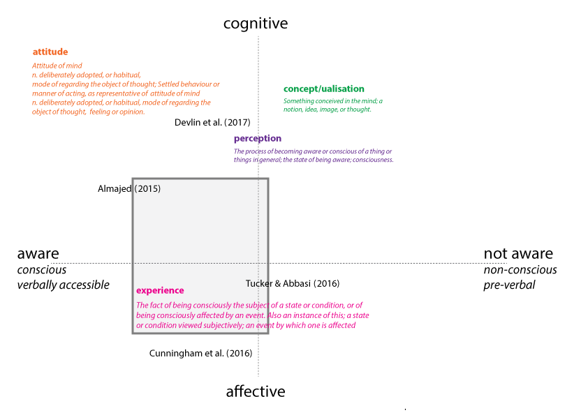
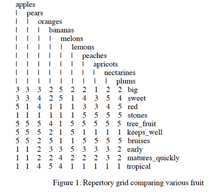

# Personal Construct Theory

This study is deliberately situated in the epistemological paradigm of constructive alternativism, a dimension of George Kelly's  Personal Construct Theory, which developed into Personal Construct Psychology (or PCP) {Kelly, 1955 #8562}. This view proposes people are agentic and can re-create themselves if they have the “courage and imagination” to do so {Fransella, 2005 #8560} (p 5). The alternativism to which Kelly refers is the capacity to think “as if” {Fransella, 2005 #8560} (p 5) there are alternative constructions to the “reality” we experience, which is also [socially] constructed:

>It is often the case that a person has bought into some restricting social constructions of herself or her world so readily offered up by friends or injected into consciousness through the general social surround. She then takes those constructions to be real and sees no possibilities for viable change. {Epting, 2005 #8563} (p 114).

Kelly rejected both behavioural and psychodynamic psychological approaches as removing individual agency, instead drawing from Dewey’s philosophy, Korzybski’s linguistics, Vaihinger’s “as if” hypothesising, and Moreno’s psychodrama to position his theory within the intellectual environment of the early twentieth century {Fransella, 2005 #8560}.

He rejected the focus on interpretations of client behaviour by therapists, instead arguing that the only measure of an intervention was its utility and relevance to the client’s problem and offering a novel path to a solution. {Fransella, 2005 #8560} (p 23).

The abstraction of PCP structures respects the individual and cultural differences of humans, and asks the practitioner to adopt a “credulous” approach, instead of criticising the patient and insisting they conform to an established model; to see the world through their frames; and to not only tolerate differing points of view, but also “devote himself to the defence and facilitation of widely distributed patterns of life” {Kelly, 1955 #8564} (p. 37).

This relatively value-free expression of each participant’s inner constructs is aligned with the principles of student-centred research, and the needs of the complex sociocultural, educational and professional landscapes our learners inhabit.
In relation to “learning”, Kelly holds that that it can not be differentiated from other psychological and human development processes, instead, it is the fundamental human experience of movement {Fromm, 2003 #8557}.

He also rejected the traditional cognitive/affective dichotomy, preferring to foreground ingrained cultural constraints, with emotions signalling a “sometimes threatening transition in our construing” {Fransella, 2005 #8560} (p 29) and a holistic approach to enquiry an opportunity to reinvigorate psychology {Bannister, 2003 #8565}.

The person is not externally caused by either inherent characteristics, or extrinsic stimulus, but the agent of their experience {Bannister, 2003 #8565}, and their experience comprises the successive construing of events, not the events themselves {Kelly, 1955 #8562} (p 52).

In a 1966 essay, Kelly described the unit of experience as a “cycle embracing five phases: anticipation, investment, encounter, confirmation or disconfirmation, and constructive revision” {Kelly, 2003 #8510} (p 12).

This perspective is a good fit for contemporary sociocultural models of knowledge construction involving, reflective practice and metacognition {Bereiter, 1996 #1174} {Committee on Developments in the Science of Learning, 2000 #145}, the trialogical approach shown above at Figure 3, and the PBL approach we have seen in other studies around collaboration {Stacey, 2005 #7978; Parkes, 2010 #7950; Cochrane, 2008 #7966; Almajed, 2015 #7919}.

Four corollaries of Kelly’s Fundamental Postulate are particularly significant in relation to this study:
1.	The Individuality Corollary, “persons differ from each other in their interpretation of events”;
1.	The Commonality Corollary, “to the extent that one person employs a construction of experience that is similar to that employed by another, his psychological processes are the same as the other person’s”;
1.	The Sociality Corollary, “to the extent that one person construes the construction processes of another, he may place a role in a social process involving the other person;
1.	The Experience Corollary: “a person’s construction system varies as he successively construes the replication of events” {Kelly, 1955 #8562} (pp 72-73).

### Individuality Corollary
As the focus of this study is to uncover new information about how students construct their experience of group work, the range and differentiation of responses will form part of the data analysis. This will address the individual aspect of the data collection and analysis.
### Commonality Corollary
As an aim of this study is to analyse both differences and similarities in constructions, the clustering and distribution of responses will form part of the data analysis. This will address the group aspect of the data collection and analysis.
### Sociality Corollary
As an aim of this study is to explore collaborative processes, the change in responses over time will form part of the data analysis. This is applicable in both individual and group dimensions.
## Experience Corollary
As an aim of this study is to foreground the whole person engaged in the collaborative processes, clarification of what we mean by experience is necessary in order for data collection to be valid. As another aim of the study is to add to existing research, clarification of where we consider experience is located relative to other measures is necessary in order for data collection to be meaningful within that landscape.
The data collection in this study will be verbal and textual responses provided through individual personal interviews and a mediating technology layer.

Where previous studies have used a range of terminology for their qualitative data, this study will use the term experience, which has both logical integrity within plain English comparisons of the terms, and Kelly’s Experience Corollary, above. The literature refers to a range of measures: “attitudes” {Devlin, 2017 #7910} (p v), “experience” {Cunningham, 2016 #7914} (p 30), “perceptions and experiences” {Tucker, 2016 #7915} (p 1), and “perceptions about experiences” {Almajed, 2015 #7919} (p 4) among others. If we consider those to be the dominant frameworks for understanding learner thinking, is helpful to unpack those ideas within traditional definitions placed within a set of dimensions based on language and theory (Figure 4).

_Figure 4: Oxford English Dictionary definitions of key terms {Dictionary,  #8546;Dictionary,  #8547;Dictionary,  #8548;Dictionary,  #8549} used by other studies located within cognitive/affective poles and the awareness continuum from Kelly (1955/1991)._

Viewing these definitions within the Kelly frame, experience is different from concept/ualisation because it has an affective dimension; from perception in nuance because comparison over time encompasses both fact and process but also interacts with conditions or events; and from attitude because attitudes assume a deliberate stance that does not encompass an emergent affective dimension. Kelly construed the Freudian unconscious as a continuum along all levels of awareness, from pre-verbal at the “lowest” level to and conscious at the “highest” {Fransella, 2003 #8566} (p 59). The levels are predominantly cognitive, but Kelly is clear that they are to do with contextual sense-making, and that a person may construe at a lower level in situations where elements lie at the outer edge of the range of convenience of their constructs, for example, “using the construct of suggestibility to explain dental caries” {Kelly, 1955 #8562} (p 351). By eliciting elements and constructs directly from participants, it is likely that both elements and constructs in this study will be within their range of convenience and that they will be construing toward the conscious and verbally-accessible end of the awareness continuum. Participant experience is likely to occupy a range of positions along the cognitive/affective axis, indicated by the shaded grey box in Figure 4.

## The Repertory Grid Technique (RGT or RepGrid)
The purpose of RGT is to reveal for ourselves the beliefs we use to make predictions and have a “map” of thinking with which to investigate possible change {Fransella, 2004 #8488}. The technique was developed by {Kelly, 1955 #8562}, as a sense-making tool based in the client’s reality, which could allow therapists to see that reality without imposing the therapist’s beliefs on the client {Fransella, 2004 #8488}. Outside a therapeutic context, RGT has been used as a diagnostic research method to explore passenger-air crew interactions in the 1980s {Brophy, 2005 #8508}, provide market research feedback {Pike, 2003 #8383} in cross-cultural contexts {Tomico, 2009 #8381}, investigate bullying {Epting, 2005 #8500}, foreground tacit knowledge in management decision-making {Jankowicz, 2001 #8507}, and to elicit the knowledge expert systems require {Boose, 1985 #8570; Ananth, 2011 #7750}.

There are precedents for its use in education. {Aditomo, 2011 #7747} used the technique to connect perceptions about learning activities to writing performance. Their study found RGT a “useful and practically viable” approach revealing both whether and how high and low performing participants construed their collaborative writing task, and the specific combinations of elements and constructs that students prefer {Aditomo, 2011 #7747}. {Vatrapu, 2012 #8495} developed an online RGT tool {Vatrapu, 2015 #8669} allowing teachers to monitor learners’ knowledge structures in real time, seeing what concepts they thought of as similar/dissimilar {Vatrapu, 2012 #8495}. This kind of computational support {Vatrapu, 2015 #8669} could realise the potential of RGT as a shared visualisation and problem-solving tool {Vatrapu, 2012 #8495} as well as providing rich data helping to inform design decisions {Aditomo, 2011 #7747}.

Repertory Grid Technique is an operationalisation of Kelly’s Fundamental Postulate: “a person’s processes are psychologically channelized by the ways in which he anticipates events” {Kelly, 1955 #8562} (p 72). In a grid, one axis will contain the ways, which are the constructs represented by a bipolar continuum, and the other the events, which are the elements {Bell, 2005 #8497} (p95).

 Kelly’s position is that a construct is a basic contrast between concepts reflecting how we distinguish between them. So, the bipolar contrast to passive might be expressed as active, interesting, or interactive, depending on the individual construing of the participant. If the participant’s experience of complex systems at the time of interview are that they are mostly efficient (considered the positive polarity) rather than time-consuming, their response would look like Figure 5. While self-report is often associated with measurement error, and it is impossible to rule out extrinsic influences in our context, RGT’s individualised continua and longitudinal data collection should reduce overall error.

_Figure 5: Example of the element meeting being construed by a participant as toward the efficient end of the continuum_

In a more complete example, {Crowther, 2007 #8552} show how the combination of multiple constructs applied to multiple elements with additional ratings across constructs results in a complex and data-rich matrix of responses (Figure 6).

_Figure 6: Repertory grid example from Crowther (2007) (p 3)._

Repertory Grid Technique has some technical affordances in that it can be enacted manually or digitally, and can be facilitated or automated, meaning previous issues with the time taken to conduct the data collection and analysis {Curtis, 2008 #8551} may be reduced. While we recognise the limitation of the time taken to elicit elements and constructs {Aditomo, 2011 #7747}, a longer-term aim of the project is also to understand whether and when these reach saturation.

 In relation to this study, it has two other specific applications. Firstly, the technique proceeds from the underlying philosophy that it will elicit those concepts that are contextually important, rather than imposed by the researcher, by which we aim to explore those constructs relevant to learners around collaboration that have not been uncovered by previous studies. Secondly, the combination of qualitative and quantitative data accessible through RGT is open to multiple types of analysis across both structured and unstructured dimensions. This rich story of what students experience group work to be for them has the potential to inform design for more effective collaboration.
