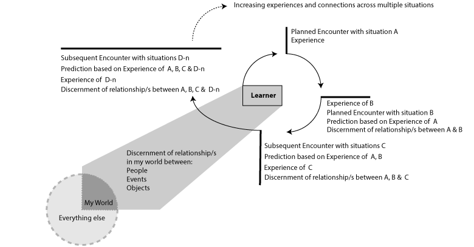

Phenomenography, as a learning sciences research tool, is concerned with enquiring into the variations in experience of different people in similar situations. In educational research specifically, it is concerned with what the "outcome space" is for students when asked how they structure their understanding of the system of inquiry, for example, digital affordances for collaboration {Markauskaite, 2015 #8113}. It is usually conducted by in-person interview, in a semi-structured form, and then the individual responses aggregated to determine a "range of themes"  characterised as "categories of description", which in turn form the "outcome space". This open-ended method was developed ...

From a Learning Sciences perspective, discussion around how learning might be observed has centred for many researchers around the concept of _transfer_ {Lobato, 2006 #8120}. The key point of difference for Lobato between the classical model and her ged perspective is that instead of a formulaic response to recognition of a known situation, the response that emerges is constructed from all prior activities - not limited to formal learning environments {Lobato, 2006 #8120}. The outcome is measured not by improved performance in that known situation, but by using ethnographic methods to identify those activities have influenced the response and compare similarity of responses between people {Lobato, 2006 #8120}.

In her critique of transfer theory, she describes how her own previous studies [should I add a citation for those here?] found that _focusing phenomena_ such as "mathematical language", "features of the curricular materials" and "use of artifacts" co-constitute the _object of focus_ together with the "prior knowledge, experience and goals" of the students {Lobato, 2006 #8120} (p. 443). This brings in to view the socially situated selves which students bring to learning environments, within which any generalisability of outcome must inevitably be integrated. This combination of representational and environmental affordances with the learner's sociocultural context is a perspective generally consistent with the theme of knowledge co-construction. That makes the next work that she then introduces in a special issue of the _Journal of the Learning Sciences_ even more significant.

Lobato (2006) introduces the work of Ference Marton as "a radical reversal of 100 years of transfer research" (p. 443). Where others emphasised similarity between the task whose skills were intended for transfer and the destination task, Marton argues that what learners pay attention to might be the differences instead of the similarities, and that discernment is just as valid a mechanism for observing what the learner is capable of doing in subsequent situations {Marton, 2006 #8121}. Explicitly, that

...
"the relation between any two situations is contingent upon the relation between each of the two situations and other situations that are relevant for what is to be learned **as seen from the learner’s point of view**." {Marton, 2006 #8121}(p. 503; this author's emphasis).
...

Two points of Marton's here are key for this thesis. The first is the primacy of the learner's perspective on the connection/s between situations. The second is that for any kind of situated performance measure, using two isolated situations (in sequence) as a focus lacks sufficient relational connections to be meaningful to the learner. Marton uses an example from a study around children learning about light refraction and water displacement. He describes that to solve the problem (hitting a target at a different level and range from the initial target) the participants needed first to notice that as one aspect (water depth) of the problem varied, another aspect (displacement) also varied. The first thing noticed was the variation - the difference - and only then is the similarity - the simultaneity -  also seen {Marton, 2006 #8121}. The variation becomes a resource to draw on when designing a solution.

This attention to differences at both functional and theoretical levels was seen at the time as controversial, as we can see by {Lobato, 2006 #8120} comment above. Marton didn't dismiss Lobato, arguing for multiple cases to make discernment of the principle more likely as well as drawing the learner's attention (in a similar manner to the _focusing phenomena_ above) to the shared features. His point in relation to the learning sciences research field is that the from the traditional transfer point of view, the learner's discernment can not occur at Situation A, because with only one situation, there can be no comparison. Only at Situation B will the similarity or difference be observed {Marton, 2006 #8121}. The effect is then dependent on the second situation, and then subsequent situations that may be encountered for comparison. If we look at this diagrammatically, Figure [F] shows how multiple situations can deepen learner understanding of the types and strengths of their relationships.

Figure [F]: Illustration of Marton's argument for multiple situations extending learner capacity for discernment.
[Marton's situations](https://github.sydney.edu.au/crli/repgrid/blob/master/images/Marton-Situations.png)

You might argue that the learner progress through multiple situations in Figure [F] is equally representative of the traditional transfer model, where each stage of the cycle is one iteration of the trained task. One important difference here is that the Learner is a complex system whose approach to learning is dynamic and emergent from their life outside formal education. The other important difference is that the contemporary Learning Sciences has an additional more abstract view that groups of learners themselves comprise a system during their learning experiences - particularly formal learning experiences. Both these elements of learning as they relate to co-constructing knowledge are discussed in more detail in [Chapter]; here it can be said Marton's arguments are aligned enough to be introduced by Lobato (2006) in the  _Journal of the Learning Sciences_ (2006) as we've seen above. Figure [F] explicitly incorporates the relationship between Learner as seen by Marton (2006).
Figure [F]: Illustration of Marton's argument for multiple situations extending learner capacity for discernment including the unique perspective each learner brings from their relationships in their own world/s.

If we set aside the traditional task similarity transfer model, what remains to demonstrate what has been learned? As Labato (2006) hinted, while Marton's most inclusive definition of transfer emerged as "relations between what people learn and can do in different situations" {Marton, 2006 #8121}(p. 510), he ultimately rejects the concept of transfer as redundant. He argues instead that investigating what has been learned should be about the generalisations students develop by making connections between the differences in multiple situations {Marton, 2006 #8121}. He goes so far as to say that a theory can not be understood without a comparable set of conceptions, even if that alternative theory is not scientifically accepted as correct. 

This is a point generally shared by Lave who agreed that learning can not be confined to the laboratory or school and can not occur outside the "lived in" world {Lave, 1988 #8125}.

 and the importance of discernment to develop , what is not addressed in this is what similarity or difference is observed? It is still tacit, lurking within the black-boxed learner unless we can find a way in.

 Where Marton said that "learning is a function of perceived differences (and similarities) in the learning situation" ,   However, subsequent work has shown that

 Instead, he argues that systematic variation between the learning and destination situations is the only way to distinguish what has actually been learned {Marton, 2006 #8121}. "Variation theory"

This is the relationship of importance for solving this particular problem.  

Analogical encoding

Representation of that difference as changed

This range is similar to what in Epistemic Network Analysis might term "the universe of discourse" at a local level. It does not capture the total world conception of experience, but the realm of experiences over the cohort that is being surveyed. Both the data collection and analytical components are resource intensive, with multiple stages of interview, transcription, sorting and modelling conducted iteratively in order to collect the richest data possible. Emerging technologies such as automated transcription and qualitative data analysis applications are reducing some of the the "grunt" work, and still this method needs a thorough understanding of the disciplinary discourse in its original Martonian form.

Other researchers have varied the method

While Phenomenography is well-validated methodology with a stable research base in education, most researchers [] in this area recognise that it is difficult to conduct at scale for a number x of reasons. The first barrier is the amount of time taken to conduct the data collection and make it accessible to thematic and/or statistical manipulation. A second barrier is the nature of data collection in semi-structured interview and the complex nature of the interview record where the participants may have diverse ways of framing the question responses.

In the current 2020 research context, meeting over Zoom and being able to automatically record and transcribe interviews will be of some assistance in this regard, and emerging technologies   

The theoretical similarity between phenomenography and RepGrid may have been obscured because of the frequent location of both within Psychology despite a tight connection with the foundational educational principles of John Dewey. Dewey's influence is specifically acknowledged by Kelly in relation to the "anticipatory nature of behaviour and the person's use of hypotheses in thinking" [Kelly 1955 vol1 p. 90] and reflected in Kelly's Fundamental Postulate "A person's processes are psychologically channelized [sic] by the ways in which he anticipates events". Both agreed that people experience their own realities, which are a complex system of ....

At the same time as Dewey and Kelly were developing their theories in the USA and moving away from behaviourism, the field of  phenomenology was emerging in Europe. Moving away from Husserl's initial position that it was possible to suspend any and all personal beliefs in favour of experiencing the "essence" of any object of inquiry, subsequent phenomenology researchers  
