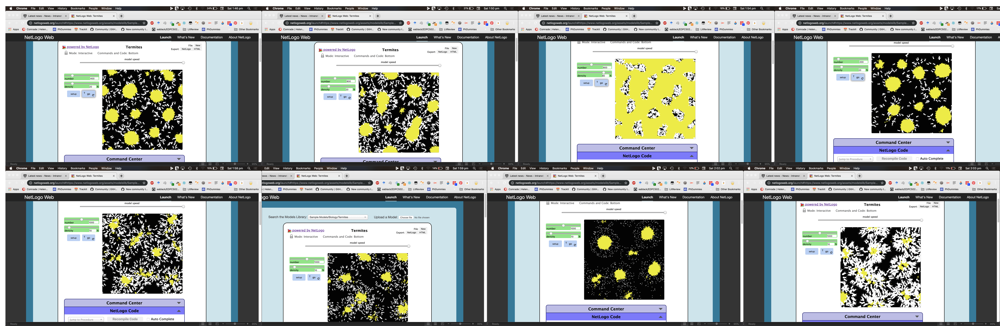

It took a whole year, but after my meeting with Andrew yesterday something that has been turning over in the back of my mind finally became really clear. I know that I should be writing instead of driving to Sydney to meet with someone who's going to do the PhD I didn't know I wanted to do BUT I will go back to writing as I think this can have a place in the 'future research potential' of RepGrid.

When Erica ran the NetLogo class for 5024 last last year, I could see what we were doing was relevant for me but couldn't make the connection. I made lots and lots of Termite mounds (hence the new title for my research, Termites & Butterflies) and knew they were important.

I now see them as snapshots of knowledge models at a point in time. The are created by varying inputs and rules for interactions taking place over time. They provide immediate feedback when you vary the inputs. And they are both programmable and scalable.

I've been thinking (and talking to Andrew) a lot  about RepGrid being able to create learner models, then through comparison highlight areas of divergence from an "expert" model. A complete learner model may be comprised of multiple discipline (or ULO-based, or whatever), compared against multiple expert models. The expert model "set" may be idealised as a whole entity, or comprise of discrete models, depending on the level of sophistication/integration.

The model construction process takes place when the expert or learner completes a Rep Test. If we consider the patches in ABM to be grid squares, each square will have a numerical value. There will be a consequent difference or similarity between a single patch (rating of an element on a construct) in the expert and learner models, with an initial aim of that equalling zero, the expert and learner models having identical values.

At the moment, it is a manual process to compare two or more grids using either the RepPlus or the WebGrid applications. It is not user-friendly and requires some reference to the application documentation for both the process and potential immediate interpretation. With large datasets, it can be time-consuming to fully explore patterns across individuals and groups, and trajectories from initial to subsequent survey completions. However, the data this captures would be a rich and, from a Learning Sciences perspective, a _thick_ description of not only what has changed across constructs and elements, but all the incremental steps leading up to the change.  

While it doesn't have the ethnographic attention to gesture and tone, it is a _thick_ description because it is an "interpretation of an interpretation of what is going on". It seeks to understand each moment as a relational matrix between the participant and their current "range of convenience". This range should, and in educational contexts hopefully will, continue to extend as the human inside the "participant" anticipates events and updates their internal representations with the feedback they integrate in the course of their existence. As the full scope of their experience is not of a nature which can be captured by educational research methods, this allows us to observe the effects of that experience if not control it. The description is not _thick_ in the way of true ethnography, with vast multi-modal records requiring integration of years of observations where each eye twitch is completely contextualised as far as the observed and observer can agree.

It is _thick_ because what is observed contains either explicit or tacit constructs comprising a level of abstraction from the elemental propositions whose family comprises the range of convenience of the participant. While we do not capture their wider surroundings - their home, their friends, their workplace - to impute intention to their responses, we do capture the effects of these surroundings in their data. Importantly, this data does not lose its authenticity under analysis when the Repertory Grid Technique is used. While partial and imperfect, it is still a representation of the total logical framework within that range. It is a valid and useful learner model.

We have seen that the research around how people learn and how that can be measured is a contested space in research. At present, Learning Analytics systems of various kinds are beginning to use user data more meaningfully in an attempt to "personalise", automate and measure learning outcomes. Many of these systems require substantial human resources in order to massage data into a form that can then be fed to a semi-automated processing system. Though this process, data can be removed by one or more steps from the original source. More importantly, the analysis presupposes that each participant "observed" in an often conversational activity, uses the same words to mean the same thing in the same way. To the extent that Kelly's Sociality Corollary and to some extent the Commonality Corollary provide for the construal of another's constructions, that is useful from a Personal Construct Theory point of view. However, it may be that the grid completion process can extend the utility of these other forms of analysis as it allows for the unique social and cultural context and internal processes of individual participants to be examined through the theoretical lens of both the Individuality Corollary and the Fragmentation Corollary.

The potential of ABM-supported RepGrid lies in its capacity to generate a representation based on inputs for immediate feedback. Figure [F] shows a simplified example of an expert model based on Repertory Grid input. When the participant (or more than one participant) enters their RepGrid, an ABM could instantly represent their grid response in comparison, Figure [F] shows a simplified version of a participant grid which is not yet the same as this model. Figure [F] shows those differences in a third representation. Each different learner may respond with a different variant again, with different gaps between theirs and the expert model.

If, once the learner had been shown these representations, they could again complete a grid exercise and see in real time the difference this made to their model and to the gap between their model and the learner model they could conceivably repeat the grid exercise until their adjusted ratings and constructs matched the expert model, or the exercise was terminated. Learner models could be aggregated across the cohort to create a multi-layered learner model with the range of grid responses again compared to the expert model. As each representation is generated, a log of the model can be created for each learner, and so individual steps toward understanding across a large cohort can be captured both quantitatively and qualitatively at machine level as well as then modelled visually through animation of the different snapshots at individual and cohort levels. This trajectory data then forms a set of data models for the many ways in which learners move from their initial model to that of expert.

This is promising ground for research. We could learn quickly from this whether there is saturation or if unique trajectories continue to be created. We could observe whether particular patterns of difference or movement were correlated with the number of steps the learner took to match the expert model. We could identify parts of the expert model learners find most impenetrable, and design conversations to help learners disambiguate troublesome concepts or move past impasse. From this "productive failure" perspective, the data is helpful as a system for providing just-in-time scaffolding for subsequent learners. The expert models can be simple or complex, single or multiple, domain-specific or integrated across disciplines. If programmed in NetLogo, they could be 3-dimensional and accessible to users in VR for an embodiment of the knowledge model.

As well as being both practical and achievable in a fully-online learning environment, there are rich gamification opportunities here, for example, framing a 3D trajectory from novice to expert as a "Hero's Journey", complete with customisation of avatar and grid features, for example, using a custom Minecraft world. Because each learner has a unique trajectory, they would "compete" only with themselves and could be matched for peer "Quests" with learners having an inverse trajectory model.

These activities are resonant with the contemporary view of learning as an active and constructed inner and social process. The experience of consciously creating one knowledge model would prepare learners for understanding the process of developing other knowledge models, and the growth mindset necessary for lifelong learning. Their models are also performance artefacts; boundary objects with which to have "creative conversations". There is the potential for translation of knowledge between disciplines as learners find parallels and integrate them into their interdisciplinary understanding. Perhaps most exciting is the potential for our existing expert models to be updated by the new knowledge our learners are co-creating, new ways of knowing and representing our reality. This data could expose connections and inconsistencies between disciplines and domains we would not have been able to see without a large budget and workforce.
