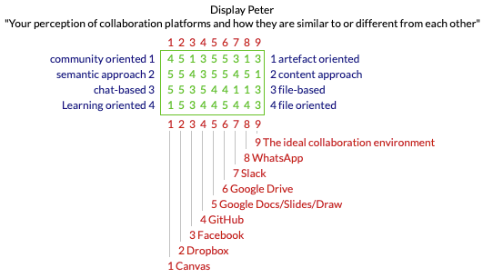
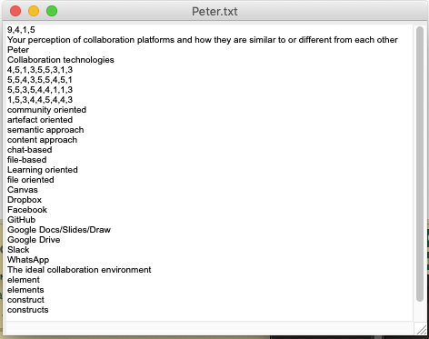
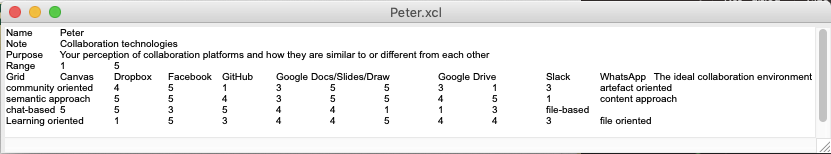
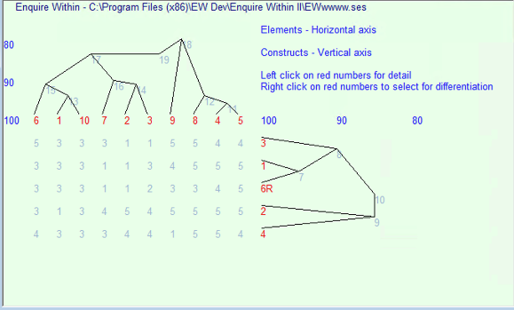
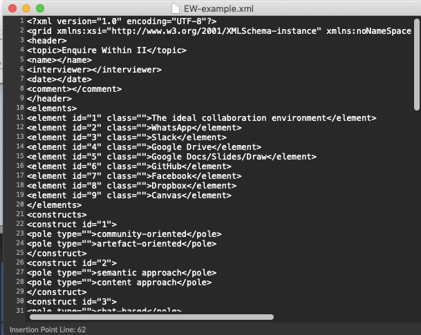
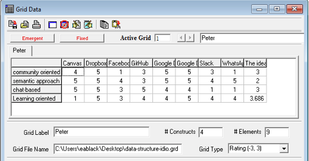
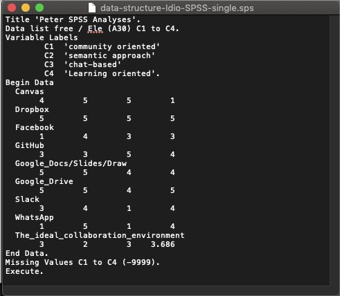

Even without the representational and analytical value-add of Agent-Based Modelling, the Repertory Grid Technique has much to offer the field of educational research. As it gathers individual and in many cases unique data,  analytic techniques evolved from the method's origin in Personal Construct Psychology can be useful insights into the learning process, and the individual or aggregated data is also well-suited to other methods used in the Learning Sciences.

As discussed in Section § [the bit where I explain all the different built-in outputs from RepGrid], several data collection types have been used with RepGrid including one or more of one-to-one and group interview/s, handwritten form completion and computer-based input. While there is both validity and simplicity in the first two methods, digital data input has the advantage of being machine-interpretable. If you use one of these applications as an element and/or construct elicitation tool, the data structure input for analysis will be generated by the tool. If you manually add data into an application, it is likely to be the same. In both cases it could be either (or both) the participant themselves adding the data during the elicitation, or the researcher. The data formats vary slightly between tools. Figures [FF] show the data formats within and exported from the RepPlus application. RepPlus can also be scripted to export grids in the .XML document format.

**Caption: raw data response generated within RepPlus when .rgrid file from WebGrid is uploaded and the "Display" option is selected.**

_Source .rgrid </Users/eb/Dropbox/Documents/-Fed/Termites-and-Butterflies/Data/5024-S2-2019/5024-0-3-muddyp/Peter.rgrid>_

_Image /Users/eb/Dropbox/Documents/-Fed/Termites-and-Butterflies/Documents/0_Chapters/images/data-structure-repplus-raw.png_

**Caption: text format result of data export from RepPlus based on the .rgrid file displayed at Figure [F] above.**

_Source .rgrid </Users/eb/Dropbox/Documents/-Fed/Termites-and-Butterflies/Data/5024-S2-2019/5024-0-3-muddyp/Peter.rgrid>_

_Image </Users/eb/Dropbox/Documents/-Fed/Termites-and-Butterflies/Documents/0_Chapters/images/data-structure-repplus-text.png>_

**Caption: "spreadsheet" format result of data export from RepPlus based on the .rgrid file displayed at Figure [F] above.**

_Image </Users/eb/Dropbox/Documents/-Fed/Termites-and-Butterflies/Documents/0_Chapters/images/data-structure-repplus-xcl.png>_

Enquire Within also produces a grid  as shown in Figure [F]. This is less developed than the same dendrogram view available in RepPlus, and I have added a fifth construct "production-oriented" versus "communication-oriented" as that is the minimum number required to display the graph. An example of XML output from this application is shown in Figure [F], with the full schema at Appendix [X].

**Caption: "Analysis View" of the same RepGrid data plus one additional construct.**

_Image </Users/eb/Dropbox/Documents/-Fed/Termites-and-Butterflies/Documents/0_Chapters/images/data-structure-EW-dendro.png>_

**Caption: RepGrid data from Enquire Within exported as XML.**

_Image </Users/eb/Dropbox/Documents/-Fed/Termites-and-Butterflies/Documents/0_Chapters/images/data-structure-EW-XML.png>_

Other machine-interpretable formats are available, for example, the Idiogrid application output (input shown at Figure [F]) can be structured for SPSS and SAS, with SPSS supporting multiple grids for analysis. An example of the SPSS output is below at Figure [F]. Other platforms accommodate Excel or text import and there are conversion tools available between most of these formats. This demonstrates clearly that the elicited data from Repertory Grid surveys is accessible in a digital format that is flexible and interoperable while at the same time retaining original participant response/s. On its own, this simple and open data capture method is valuable for both learner and instructor. However, there is an equally or more important affordance of digital data analysis.

**Caption: Manually entered RepGrid data in Idiogrid.**

_Image </Users/eb/Dropbox/Documents/-Fed/Termites-and-Butterflies/Documents/0_Chapters/images/data-structure-idio.psd>_

**Caption: Manually entered RepGrid data in Idiogrid.**

_Image </Users/eb/Dropbox/Documents/-Fed/Termites-and-Butterflies/Documents/0_Chapters/images/data-structure-idio-spss.png>_

If we look across the contemporary educational research literature, several consistent themes and paradigms can be observed. For example, 

### FOCUS Grid

The FOCUS grid looks for similarity
  
